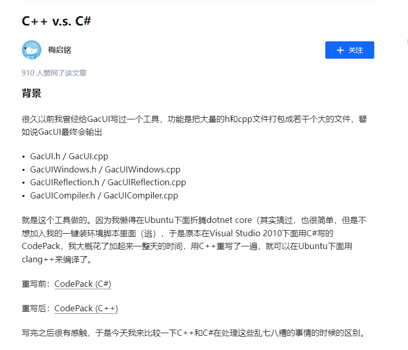

# 日记：改造轮子哥 vczh 的 Code Pack

## 1. 起因

最近，写了一个命令行处理类叫 `jmCmdLine`，源代码本来是分布在几个头文件里，但对于这种简单的 `Header Only` 代码，还是整合成一个头文件比较的方便。于是，我想找一个能自动合并头文件的工具，`Google` 和 `百度` 了一下，没有找到。无意中，我搜到了 `vczh` 写的这篇文章：[C++ v.s. C#](https://zhuanlan.zhihu.com/p/28632405) 。



点进去一看，大概是我想要的，窃喜。可是好景不长，文章的 `C++版` 链接 [CodePack (C++)](https://github.com/vczh-libraries/Vlpp/blob/master/Tools/CodePack/CodePack/Main.cpp) 点进去，显示 “404” 。把地址的后缀删掉一些，找到主库 “Vlpp”，可是里面也已经没有 Tools 目录了。由于不知道为何链接失效，翻了半天作者的 `GitHub`，终于在这里找到了 [https://github.com/vczh-libraries/VlppParser2/tree/master/Tools](https://github.com/vczh-libraries/VlppParser2/tree/master/Tools) 。

打开源码 `Codepack.h` 一看：

```cpp
#include "VlppGlrParser.h"

using namespace vl;
using namespace vl::collections;
using namespace vl::filesystem;
using namespace vl::glr;
using namespace vl::glr::xml;
using namespace vl::regex;
using namespace vl::console;
using namespace vl::stream;

......
```

这……尼玛，一个小东西依赖这么多，玩个锤子啊，瞬间就放弃了。所以，我回头去找他写的 `C#` 版，`C#` 拿来就能用，基本没有什么依赖，轻松加愉快。

## 2. 阅读 C# 版代码

`C#` 版的源码在这里：[CodePack (C#)](https://github.com/vczh-libraries/Tools/tree/master/DeprecatedTools/Codepack) - [https://github.com/vczh-libraries/Tools/tree/master/DeprecatedTools/Codepack](https://github.com/vczh-libraries/Tools/tree/master/DeprecatedTools/Codepack)

打开 [/Codepack/Program.cs](https://github.com/vczh-libraries/Tools/blob/master/DeprecatedTools/Codepack/Codepack/Program.cs) 一看，还好，没有使用 `Tab` 字符，使用的是空格，好感度增加。

准备阅读和调试程序，可是既然要调试，没有配置文件怎么能行，虽然 `CodePack (C#)` 仓库里并没有提供所需的 `xml` 配置文件，但在作者的文章 [C++ v.s. C#](https://zhuanlan.zhihu.com/p/28632405) 里有一份。

这里吐槽一下，这样很不专业，就算作者自己调试的时候不需要配置文件，那拿到这份源码的人，如果没有配置文件，他还要去源代码里反过来猜出配置文件吗？如果作者本人以后要继续修改源码，要调试怎么办？

你不要以为是因为这个工具是已经被 `Deprecated` (废弃) 了的，所以才这样，即使在那个 C++ 版的 CodePack 里，同样也没有提供示范用的 `xml` 配置文件。

反过来看，我又是怎么做的？在我修改的 `C#版 - CodePack` 仓库里：[https://github.com/shines77/CodePack](https://github.com/shines77/CodePack) ，大到 `xml` 配置文件，小到 `Debug` 模式下的调试参数和路径，我都给你设置得服服帖帖的。你也许会问为什么调试路径也可以设置，因为有一个东西叫做 “`相对路径`” 。此外，我还提供了运行配置文件所需的所有 `源代码` 文件和目录，全部都 “开箱即用” 的。

这方便我自己以后继续改进这个项目，以及也方便未来拿到这份源码的朋友继续改进和调试。我做了所有我能想得到的一切。

示范的配置文件如下：

```xml
<?xml version="1.0" encoding="utf-8" ?>
<codegen>
  <folders>
    <folder path="..\Source" />
    <folder path="..\Import" />
  </folders>
  <categories>
    <category name="vlpp" pattern="\Import\Vlpp."/>
    <category name="wfruntime" pattern="\Import\VlppWorkflow."/>
    <category name="wfcompiler" pattern="\Import\VlppWorkflowCompiler."/>
    <category name="gacui" pattern="\Source\">
      <except pattern="\Windows\" />
      <except pattern="\WindowsDirect2D\" />
      <except pattern="\WindowsGDI\" />
      <except pattern="\Reflection\" />
      <except pattern="\Compiler\" />
    </category>
    <category name="windows" pattern="\Source\GraphicsElement\WindowsDirect2D\" />
    <category name="windows" pattern="\Source\GraphicsElement\WindowsGDI\" />
    <category name="windows" pattern="\Source\NativeWindow\Windows\" />
    <category name="reflection" pattern="\Source\Reflection\" />
    <category name="compiler" pattern="\Source\Compiler\" />
  </categories>
  <output path=".">
    <codepair category="vlpp" filename="Vlpp" generate="false"/>
    <codepair category="wfruntime" filename="VlppWorkflow" generate="false"/>
    <codepair category="wfcompiler" filename="VlppWorkflowCompiler" generate="false"/>
    <codepair category="gacui" filename="GacUI" generate="true"/>
    <codepair category="windows" filename="GacUIWindows" generate="true"/>
    <codepair category="reflection" filename="GacUIReflection" generate="true"/>
    <codepair category="compiler" filename="GacUICompiler" generate="true"/>
  </output>
</codegen>
```

## 3. 调试代码

上面这份配置文件显然是不符合我们用的，所以参考它修改一下。

我的 C++ 源码的文件结构是：

```text
./src
├── jmCmdLine
│   ├── benchmark.cpp
│   ├── CmdLine.h               *
│   ├── CPUWarmUp.h
│   ├── jmCmdLine.h             **
│   ├── jstd
│   │   ├── apply_visitor.h     *
│   │   ├── char_traits.h       *
│   │   ├── function_traits.h   *
│   │   └── Variant.h           *
│   └── StopWatch.h
```

其中打 `*` 号的是要合并的头文件，打 `**` 的是我们要合成的目标文件。

所以，配置文件可以写成这样：

```xml
<?xml version="1.0" encoding="utf-8" ?>
<codegen>
  <folders>
    <folder path=".\src\jmCmdLine" />
  </folders>
  <categories>
    <category name="jmCmdLine" pattern="\jstd\" />
    <category name="jmCmdLine" pattern="\CmdLine.h">
      <except pattern="jmCmdLine.h" />
    </category>
  </categories>
  <output path=".\src\jmCmdLine">
    <codepair category="jmCmdLine" filename="jmCmdLine" generate="true" />
  </output>
</codegen>
```

经过调试，发现一个很严重的问题，例如，在搜索源代码的内容时，当扫描到非系统头文件的引用时，例如：

```cpp
// 在 .\src\jmCmdLine\jstd\Variant.h 文件中

#include "jstd/char_traits.h"
#include "jstd/apply_visitor.h"
```

代码里是这么处理的：

```C#
static Regex IncludeRegex = new Regex(@"^\s*\#include\s*""(?<path>[^""]+)""\s*$");

foreach (var line in File.ReadAllLines(codeFile))
{
    Match match = IncludeRegex.Match(line);
    if (match.Success)
    {
        string path = match.Groups["path"].Value;
        path = Path.GetFullPath(Path.GetDirectoryName(codeFile) + @"\" + path).ToUpper();
        if (!directIncludeFiles.Contains(path))
        {
            directIncludeFiles.Add(path);
        }
    }
}
```

扫描源文件的没一行，当匹配到规则表达式 `IncludeRegex` 后，是按当前正被扫描的源代码 `codeFile` 所在的目录 `Path.GetDirectoryName(codeFile)` 为基准，在尾部加上 `\` 和 `#include` 的路径 "`jstd/char_traits.h`" 拼出被引用的头文件的路径。

例如：

`codeFile` 是 `.\src\jmCmdLine\jstd\Variant.h` ，那么 `Variant.h` 中 `#include "jstd/char_traits.h"` 的头文件实际路径是：

```java
 (".\src\jmCmdLine\jstd\Variant.h" 的目录) + "\" + "jstd/char_traits.h"
=
 ".\src\jmCmdLine\jstd" + "\" + "jstd/char_traits.h"
=
 ".\src\jmCmdLine\jstd\jstd/char_traits.h"
```

但是 `".\src\jmCmdLine\jstd\jstd/char_traits.h"` 路径是不对的，正确的路径应该是：`".\src\jmCmdLine\jstd/char_traits.h"` 。这里路径中的 `\` 和 `/` 字符的区别，C# 是能正确识别的，所以这里不用管它。

为什么会这样呢？很简单，因为轮子哥 `vczh` 写 `C++` 项目基本是不用 `include path` (包含路径) 的，我不敢说 100% 吧，但是 80% - 90% 的可能性是有的，甚至可能就是 100% 。

我们顺便找几个 `GacLib` 里的几个源码，例如：

/GacLib/Source/Compiler/InstanceLoaders/GuiInstanceLoader_TemplateControl.h

```cpp
#include "../../Resources/GuiResource.h"
#include "../WorkflowCodegen/GuiInstanceLoader_WorkflowCodegen.h"

......
```

/GacLib/Source/Compiler/GuiInstanceLoader.cpp

```cpp
#include "GuiInstanceLoader.h"
#include "InstanceQuery/GuiInstanceQuery.h"
#include "GuiInstanceSharedScript.h"
#include "WorkflowCodegen/GuiInstanceLoader_WorkflowCodegen.h"
#include "../Reflection/TypeDescriptors/GuiReflectionPlugin.h"
#include "../Reflection/GuiInstanceCompiledWorkflow.h"
#include "../Resources/GuiParserManager.h"

......
```

大致明白了吧，他使用的这种以 "../" 相对路径做为头文件的路径声明，这种写法一般只会出现在 C++ 新手阶段，或者虽然写了很久 C++，但并没有太多跨平台经验的人身上。这种写法，在你的项目里也许够用，能用，但是并不专业，而且很不专业。

相信熟悉 `gcc` 的朋友都知道 `gcc` 的编译选项里 `-I XXXX(路径)` 是什么意思吧。对，这就是包含路径 (`include path`)，`MSVC` 的设置里叫 “附加包含目录” 。


，但是发现以下问题：

1. `category` 内的头文件合并时的先后顺序不对；
2. 222
