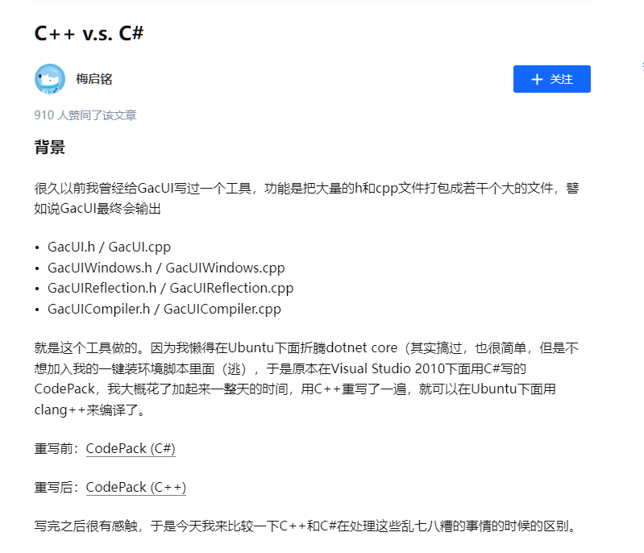

# 日记：改造轮子哥 vczh 的 Code Pack

## 1. 起因

最近，写了一个命令行处理类叫 `jmCmdLine`，源代码本来是分布在几个头文件里，但对于这种简单的 `Header Only` 代码，还是整合成一个头文件比较的方便。于是，我想找一个能自动合并头文件的工具，`Google` 和 `百度` 了一下，没有找到。无意中，我搜到了 `vczh` 写的这篇文章：[C++ v.s. C#](https://zhuanlan.zhihu.com/p/28632405) 。



点进去一看，大概是我想要的，窃喜。可是好景不长，文章的 `C++版` 链接 [CodePack (C++)](https://github.com/vczh-libraries/Vlpp/blob/master/Tools/CodePack/CodePack/Main.cpp) 点进去，显示 “404” 。把地址的后缀删掉一些，找到主库 “Vlpp”，可是里面也已经没有 Tools 目录了。由于不知道为何链接失效，翻了半天作者的 `GitHub`，终于在这里找到了 [https://github.com/vczh-libraries/VlppParser2/tree/master/Tools](https://github.com/vczh-libraries/VlppParser2/tree/master/Tools) 。

打开源码 `Codepack.h` 一看：

```cpp
#include "VlppGlrParser.h"

using namespace vl;
using namespace vl::collections;
using namespace vl::filesystem;
using namespace vl::glr;
using namespace vl::glr::xml;
using namespace vl::regex;
using namespace vl::console;
using namespace vl::stream;

......
```

这……尼玛，一个小东西依赖这么多，玩个锤子啊，瞬间就放弃了。所以，我回头去找他写的 `C#` 版，`C#` 拿来就能用，基本没有什么依赖，轻松加愉快。

## 2. 阅读 C# 版代码

`C#` 版的源码在这里：[CodePack (C#) - https://github.com/vczh-libraries/Tools/DeprecatedTools/Codepack](https://github.com/vczh-libraries/Tools/tree/master/DeprecatedTools/Codepack)

打开 [/Codepack/Program.cs](https://github.com/vczh-libraries/Tools/blob/master/DeprecatedTools/Codepack/Codepack/Program.cs) 一看，还好，没有使用 `Tab` 字符，使用的是空格，好感度增加。

准备阅读和调试程序，可是既然要调试，没有配置文件怎么能行，虽然 `CodePack (C#)` 仓库里并没有提供所需的 `xml` 配置文件，但在 `vczh` 的文章 [C++ v.s. C#](https://zhuanlan.zhihu.com/p/28632405) 里有一份。

这里吐槽一下，这样很不专业，就算作者自己调试的时候不需要配置文件，那拿到这份源码的人，如果没有配置文件，他还要去源代码里反过来猜出配置文件吗？如果作者本人以后要继续修改源码，要调试怎么办？

你不要以为是因为这个工具是已经被 `Deprecated` (废弃) 了的，所以才这样，即使在那个 C++ 版的 CodePack 里，同样也没有提供示范用的 `xml` 配置文件。

反过来看，我又是怎么做的？在我修改的 `C#版 - CodePack` 仓库里：[https://github.com/shines77/CodePack](https://github.com/shines77/CodePack) ，大到 `xml` 配置文件，小到 `Debug` 模式下的调试参数和路径，我都给你设置得服服帖帖的。你也许会问为什么调试路径也可以设置，因为有一个东西叫做 “`相对路径`” 。此外，我还提供了运行配置文件所需的所有 `源代码` 文件和目录，这一切都是 “开箱即用” 的。

这样不仅方便我自己以后继续改进这个项目，也方便未来拿到这份源码的朋友继续改进和调试。我做了所有我能想得到的一切。

示范的配置文件如下：

```xml
<?xml version="1.0" encoding="utf-8" ?>
<codegen>
  <folders>
    <folder path="..\Source" />
    <folder path="..\Import" />
  </folders>
  <categories>
    <category name="vlpp" pattern="\Import\Vlpp."/>
    <category name="wfruntime" pattern="\Import\VlppWorkflow."/>
    <category name="wfcompiler" pattern="\Import\VlppWorkflowCompiler."/>
    <category name="gacui" pattern="\Source\">
      <except pattern="\Windows\" />
      <except pattern="\WindowsDirect2D\" />
      <except pattern="\WindowsGDI\" />
      <except pattern="\Reflection\" />
      <except pattern="\Compiler\" />
    </category>
    <category name="windows" pattern="\Source\GraphicsElement\WindowsDirect2D\" />
    <category name="windows" pattern="\Source\GraphicsElement\WindowsGDI\" />
    <category name="windows" pattern="\Source\NativeWindow\Windows\" />
    <category name="reflection" pattern="\Source\Reflection\" />
    <category name="compiler" pattern="\Source\Compiler\" />
  </categories>
  <output path=".">
    <codepair category="vlpp" filename="Vlpp" generate="false"/>
    <codepair category="wfruntime" filename="VlppWorkflow" generate="false"/>
    <codepair category="wfcompiler" filename="VlppWorkflowCompiler" generate="false"/>
    <codepair category="gacui" filename="GacUI" generate="true"/>
    <codepair category="windows" filename="GacUIWindows" generate="true"/>
    <codepair category="reflection" filename="GacUIReflection" generate="true"/>
    <codepair category="compiler" filename="GacUICompiler" generate="true"/>
  </output>
</codegen>
```

## 3. 调试代码

上面这份配置文件显然是不能直接拿来用的，所以要参考它修改一下。

我的 C++ 源码的文件结构是：

```text
./src
├── jmCmdLine
│   ├── benchmark.cpp
│   ├── CmdLine.h               *
│   ├── CPUWarmUp.h
│   ├── jmCmdLine.h             **
│   ├── jstd
│   │   ├── apply_visitor.h     *
│   │   ├── char_traits.h       *
│   │   ├── function_traits.h   *
│   │   └── Variant.h           *
│   └── StopWatch.h
```

其中打 `*` 号的是要合并的头文件，打 `**` 的是最终要合成出来的目标文件。

所以，配置文件可以写成这样：

```xml
<?xml version="1.0" encoding="utf-8" ?>
<codegen>
  <folders>
    <folder path=".\src\jmCmdLine" />
  </folders>
  <categories>
    <category name="jmCmdLine" pattern="\jstd\" />
    <category name="jmCmdLine" pattern="\CmdLine.h">
      <except pattern="jmCmdLine.h" />
    </category>
  </categories>
  <output path=".\src\jmCmdLine">
    <codepair category="jmCmdLine" filename="jmCmdLine" generate="true" />
  </output>
</codegen>
```

经过调试，发现一个很严重的问题。例如，在扫描源代码的具体内容时，当扫描到非系统头文件的引用时，例如：

```cpp
/* .\src\jmCmdLine\jstd\Variant.h 文件 */

#include "jstd/char_traits.h"
#include "jstd/apply_visitor.h"
```

`CodePack(C#版)` 代码里是这么处理的：

```C#
static Regex IncludeRegex = new Regex(@"^\s*\#include\s*""(?<path>[^""]+)""\s*$");

foreach (var line in File.ReadAllLines(codeFile))
{
    Match match = IncludeRegex.Match(line);
    if (match.Success)
    {
        string path = match.Groups["path"].Value;
        path = Path.GetFullPath(Path.GetDirectoryName(codeFile) + @"\" + path).ToUpper();
        if (!directIncludeFiles.Contains(path))
        {
            directIncludeFiles.Add(path);
        }
    }
}
```

扫描源文件的每一行，当规则表达式 `IncludeRegex` 匹配成功后，是按当前正被扫描的源代码 `codeFile` 所在的目录 `Path.GetDirectoryName(codeFile)` 为基准，在尾部加上 `\` 和 `#include` 的路径 "`jstd/char_traits.h`"，拼出最终被引用的头文件的路径。

例如：

`codeFile` 的值为 `.\src\jmCmdLine\jstd\Variant.h` ，那么 `Variant.h` 中 `#include "jstd/char_traits.h"` 的头文件实际路径是：

```cpp
 (".\src\jmCmdLine\jstd\Variant.h" 的目录) + "\" + "jstd/char_traits.h"
=
  ".\src\jmCmdLine\jstd"                  + "\" + "jstd/char_traits.h"
=
  ".\src\jmCmdLine\jstd\jstd/char_traits.h"
```

但是最终的结果路径 `".\src\jmCmdLine\jstd\jstd/char_traits.h"` 是不对的，

正确的路径应该是： `".\src\jmCmdLine\jstd/char_traits.h"` 。

（注：这里路径中的 `\` 和 `/` 字符的区别，C# 是能正确识别的，所以这里不用管它。）

为什么会这样呢？很简单，因为轮子哥 `vczh` 写 `C++` 项目基本是不用 `include path` (包含路径) 的，我不敢说 100% 吧，但是 80% - 90% 的可能性是有的 。

我们顺便找几个 `GacLib` 里的几个源码，例如：

[/GacLib/Source/Compiler/InstanceLoaders/GuiInstanceLoader_TemplateControl.h](https://github.com/vczh-libraries/GacUI/blob/master/Source/Compiler/InstanceLoaders/GuiInstanceLoader_TemplateControl.h)：

```cpp
#include "../../Resources/GuiResource.h"
#include "../WorkflowCodegen/GuiInstanceLoader_WorkflowCodegen.h"

......
```

[/GacLib/Source/Compiler/GuiInstanceLoader.cpp](https://github.com/vczh-libraries/GacUI/blob/master/Source/Compiler/GuiInstanceLoader.cpp)：

```cpp
#include "GuiInstanceLoader.h"
#include "InstanceQuery/GuiInstanceQuery.h"
#include "GuiInstanceSharedScript.h"
#include "WorkflowCodegen/GuiInstanceLoader_WorkflowCodegen.h"
#include "../Reflection/TypeDescriptors/GuiReflectionPlugin.h"
#include "../Reflection/GuiInstanceCompiledWorkflow.h"
#include "../Resources/GuiParserManager.h"

......
```

大致明白了吧，他使用的是这种以 "../" 相对路径做为头文件的路径声明的方式。这种写法一般只会出现在 `C++` 新手阶段，或者虽然写了很久 `C++`，但并没有太多跨平台经验的人身上，或者一意孤行的偏执者。相信阅读过各大知名开源库的程序员，比如：`linux`，`boost`，`clang`，`llvm` 等，都不会这么写。这种用法，在你的项目里也许够用，能用，但是并不专业。一旦，作为别人项目里的依赖库，很容易导致头文件引用路径问题而凉凉。

相信熟悉 `gcc` 的朋友都知道 `gcc` 的编译选项里 `-I XXXX(路径)` 是什么意思吧。对，这就是包含路径 (`include path`)，`MSVC` 的设置里叫 “附加包含目录”，在 CMake 里叫 `include_directories` 。你也可以看到，在 `vczh` 的开源项目里，也没有一个是有用 `CMakeList.txt` 的，可想而知。

关于为什么要设置包含路径 (`include path`) 的原因，这里就不敖述了。

## 4. 改进

所以，我们要在配置文件里加一个包含路径的设置，如下所示：

```xml
<?xml version="1.0" encoding="utf-8" ?>
<codegen>
  <include-paths>
    <folder path=".\src\jmCmdLine" />
  </include-paths>
  <folders>
    <folder path=".\src\jmCmdLine" />
  </folders>
  <categories>
    <category name="jmCmdLine" pattern="\jstd\" />
    <category name="jmCmdLine" pattern="\CmdLine.h">
      <except pattern="jmCmdLine.h" />
    </category>
  </categories>
  <output path=".\src\jmCmdLine">
    <codepair category="jmCmdLine" filename="jmCmdLine" generate="true" />
  </output>
</codegen>
```

除了包含路径的问题以外，还发现了以下几个问题：

1. `category` 内的文件合并时头文件的先后顺序是不对的；

2. 合并文件时会同时生成 `*.h` 和 `*.cpp`，但有时候我们只想生成 `*.h` 文件；

3. 合并后的输出文件的编码格式默认是 `UTF-8 + BOM`，加了 `BOM` 文件标志头以后在 Linux 下的 gcc 处理可能有问题。

为了解决这几个问题，我们又增加了一些设置，配置文件变为：

```xml
<?xml version="1.0" encoding="utf-8" ?>
<codegen>
  <include-paths>
    <folder path=".\src\jmCmdLine" />
  </include-paths>
  <folders>
    <folder path=".\src\jmCmdLine" />
  </folders>
  <categories>
    <category name="jmCmdLine" pattern="\jstd\" />
    <category name="jmCmdLine" pattern="\CmdLine.h">
      <except pattern="jmCmdLine.h" />
    </category>
  </categories>
  <!-- encoding option maybe is: Default, Ascii, Unicode, UTF-7, UTF-8, UTF-32. -->
  <!-- Default is "GBK" on Chinese version Windows. -->
  <output path=".\src\jmCmdLine" encoding="Default" with-bom="false">
    <codepair category="jmCmdLine" filename="jmCmdLine" header-only="true" generate="true" />
  </output>
</codegen>
```

### 4.1 包含路径的处理

包含路径可以包含一个或多个路径，搜索是有顺序的，所以如果有多个路径，要注意路径的先后顺序。

```C#
static string[] gIncludePaths = null;

// 从配置文件读取 include-paths 列表，保存到全局变量中
gIncludePaths = config.Root
    .Element("include-paths")
    .Elements("folder")
    .Select(e => Path.GetFullPath(folder + e.Attribute("path").Value))
    .ToArray();

// 搜索匹配的 includeFile
static string FindIncludeFile(string sourceFile, string includeFile)
{
    // 从全局 include-paths 列表中搜索匹配的 includeFile
    foreach (var includePath in gIncludePaths)
    {
        string fullIncludeFile = Path.GetFullPath(includePath + @"\" + includeFile);
        if (File.Exists(fullIncludeFile))
        {
            return fullIncludeFile;
        }
    }

    // 如果 include-paths 列表中没找到，则以 sourceFile 所在的目录为基准，以相对路径搜索 includeFile
    string localIncludeFile = Path.GetFullPath(Path.GetDirectoryName(sourceFile) + @"\" + includeFile);
    if (File.Exists(localIncludeFile))
        return localIncludeFile;
    else
        return null;
}
```

搜索源文件 `sourceFile` 中声明的 `#include "XXXXXX.h"` 的头文件的真实路径 `fullIncludeFile`，如果 `fullIncludeFile` 文件不存在，则显示错误信息。

```C#
// 规则表达式：#include "XXXXXX.h"
static Regex IncludeRegex = new Regex(@"^\s*\#include\s*""(?<path>[^""]+)""\s*$");

......

foreach (var line in File.ReadAllLines(sourceFile))
{
    Match match = IncludeRegex.Match(line);
    if (match.Success)
    {
        string includeFile = match.Groups["path"].Value;
        // 搜索源文件 sourceFile 中声明的 #include "XXXXXX.h" 的头文件的真实路径
        string fullIncludeFile = FindIncludeFile(sourceFile, includeFile);
        // 如果 fullIncludeFile 文件不存在，则显示错误信息
        if (fullIncludeFile != null && fullIncludeFile != "")
        {
            if (!directIncludeFiles.Contains(fullIncludeFile))
            {
                directIncludeFiles.Add(fullIncludeFile);
            }
        }
        else
        {
            Console.WriteLine("Error: Header file not found.");
            Console.WriteLine("Source File: '{0}', Included File: '{1}'",
                              sourceFile, includeFile);
            Console.WriteLine("");
        }
    }
}
```

### 4.2 `category` 内的头文件先后顺序

在 `C++` 的头文件里，类、Enum、Union、常量、变量和函数的声明和使用都是有先后顺序的，你必须先声明才能使用。所以头文件相互间也是有依赖顺序的，尤其是 `Header Only` 的头文件里更加明显。

对于一个类的引用，可以不 `#include` 它的头文件，但是必须写前置声明（Forward declaration），且头文件里只能使用这个类的指针或引用，不能使用类的实体，这就是 `pimpl` 模式 ([Pointer to implementation](https://zhuanlan.zhihu.com/p/458947637)) 。简单的说，就是在头文件里使用 `pimpl` 指针，在 `cpp` 文件里使用 `pimpl` 指针访问这个类的接口。

但是，这只适合于同时有 `*.h` 和 `*.cpp` 文件的模式，对于只有 `*.h` 文件的 `Header Only` 模式，是不能打乱头文件的顺序的。

例如，下面的例子：

`/jstd/Variant.h` 引用了下面两个头文件。

```cpp
/* /jstd/Variant.h 文件 */

#include "jstd/char_traits.h"
#include "jstd/apply_visitor.h"
```

那么，在合并的时候，`"jstd/char_traits.h"` 文件和 `"jstd/apply_visitor.h"` 文件就必须出现在 `"jstd/Variant.h"` 文件的前面。

具体的解决办法：

我们在 GetIncludedFiles() 函数里扫描的时候，顺便在 `ScannedFiles` 字典里记录了每一个头文件的源码里，所声明包含的所有非系统头文件的文件列表，这个包含的文件列表是经过递归搜索出来的，所以会反应每一个头文件的相互包含（依赖）关系。

在 SortCategorizeSourceFiles() 函数里：

先取得每一个 `category` 里所有的头文件源码里包含其他非系统头文件的文件个数，并对其做升序的排序（从小到大），这样没有依赖任何其他（非系统）头文件的头文件将会排在文件列表 `string[]` 的前面，这样有助于减少之后排序时的 swap() 次数。

采用类似冒泡排序的原理，遍历每个 `category` 分类里的所有头文件，

```C#
// 在 GetIncludedFiles() 函数里扫描的时候，所记录下来的每一个头文件，所对应的 #inlcude 非系统头文件的文件列表
static Dictionary<string, string[]> ScannedFiles = new Dictionary<string, string[]>();

......

static int GetSourceFileIndex(string sourcefile, string[] sourcefiles)
{
    int index = 0;
    sourcefile = sourcefile.ToLower();
    foreach (var file in sourcefiles)
    {
        if (file.ToLower() == sourcefile)
            return index;
        index++;
    }
    return -1;
}

static Dictionary<string, string[]> SortCategorizeSourceFiles(Dictionary<string, string[]> categorizedFiles) {

  ......

  // Sort the categorize source file by dependecies order [asc order]
  LinkedList<string> orderedFileList = new LinkedList<string>();
  foreach (var sourceFile in orderedFiles)
  {
      orderedFileList.AddLast(sourceFile);
  }

  foreach (var sourceFile in orderedFiles)
  {
      string[] includeFiles = null;
      if (ScannedFiles.TryGetValue(sourceFile, out includeFiles))
      {
          LinkedListNode<string> sourceNode = null;
          int sourceOrder = GetSourceFileIndex(sourceFile, orderedFileList, out sourceNode);
          if (sourceOrder == -1) continue;
          foreach (var includeFile in includeFiles)
          {
              LinkedListNode<string> includeNode = null;
              int includeOrder = GetSourceFileIndex(includeFile, orderedFileList, out includeNode);
              if (includeOrder == -1) continue;
              if (includeOrder > sourceOrder)
              {
                  orderedFileList.Remove(sourceNode);
                  orderedFileList.AddAfter(includeNode, sourceNode);

                  sourceOrder = includeOrder;
              }
              else if (includeOrder == sourceOrder)
              {
                  throw new ArgumentException();
              }
          }
      }
  }

  orderedFiles = orderedFileList.ToArray();

  ......

  return newCategorizedFiles;
}
```
